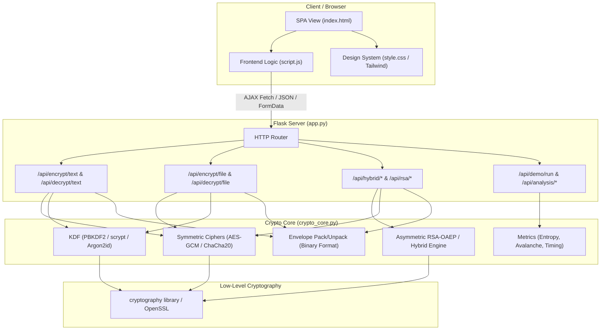
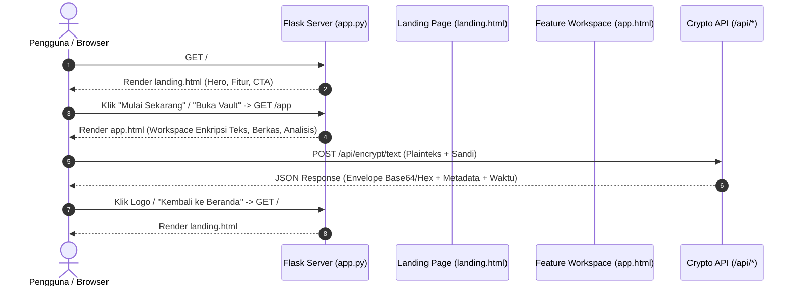

# Cipherly — Architecture & Codebase Analysis Document

## 1. Executive Summary

**Cipherly** adalah aplikasi kriptografi web berbasis Python (Flask) dan antarmuka modern (HTML5, Vanilla JS, Modular CSS). Aplikasi ini dirancang untuk demonstrasi, analisis teknis, serta penggunaan praktis enkripsi simetris modern (*AES-256-GCM*, *ChaCha20-Poly1305*), enkripsi asimetris/hibrida (*RSA-OAEP*), dan fungsi penurunan kunci berbasis memori (*PBKDF2*, *scrypt*, *Argon2id*).

Dokumen ini menyajikan:
1. Analisis arsitektur sistem saat ini (*As-Is*).
2. Spesifikasi format data & protokol kriptografi (*Binary Envelope*).
3. Target arsitektur pemisahan rute Landing Page dan Workspace Fitur (*To-Be*).
4. Panduan implementasi teknis.

---

## 2. Analisis Arsitektur Saat Ini (*As-Is Architecture*)

### 2.1 Peta Komponen (Component Diagram)



### 2.2 Struktur Berkas Proyek

```
C:\cipherly-encryption\
├── app.py                     # Entrypoint server Flask & REST API endpoints
├── crypto_core.py             # Engine kriptografi, envelope format, & algoritma
├── requirements.txt           # Dependensi (Flask, cryptography, argon2-cffi, dll.)
├── README.md                  # Dokumentasi umum proyek
│
├── static/                    # Asset statis klien
│   ├── script.js              # State UI, event listeners, API fetch handlers
│   └── style.css              # Custom styling & Dark-First design tokens
│
├── templates/                 # Jinja2 template views
│   └── index.html             # Tampilan kerja aplikasi enkripsi (all-in-one tabs)
│
├── docs/                      # Dokumentasi teknis & arsitektur
│   ├── design.md              # Design tokens & UI system guidelines
│   └── architecture.md        # Dokumen arsitektur sistem
│
├── testing/                   # Modul benchmarking & metrik performa
│   ├── benchmark.py           # Eksekusi pengujian 1KB, 1MB, 10MB, avalanche, entropi
│   ├── metrics.py             # Perhitungan Shannon entropy & bit difference
│   └── sample_files.py        # Generator file dummy pengujian
│
└── tests/                     # Unit test otomatis
    └── test_crypto_core.py    # Test suite unittest/pytest untuk crypto_core
```

---

## 3. Spesifikasi Inti Kriptografi (*Crypto Engine*)

### 3.1 Format Header Binary Envelope
Cipherly membungkus seluruh hasil enkripsi ke dalam format biner yang ringkas dan aman dengan struktur byte berikut:

| Offset (Bytes) | Panjang (Bytes) | Bidang (*Field*) | Deskripsi |
| :--- | :--- | :--- | :--- |
| `0x00 - 0x03` | 4 | `MAGIC` | Identifikasi format: `b"CKV1"` |
| `0x04` | 1 | `ALGO_ID` | `0x01`: AES-256-GCM, `0x02`: ChaCha20-Poly1305 |
| `0x05` | 1 | `KDF_ID` | `0x01`: PBKDF2, `0x02`: scrypt, `0x03`: Argon2id |
| `0x06 - 0x15` | 16 | `SALT` | Salt kriptografis acak untuk KDF (16 bytes) |
| `0x16 - 0x21` | 12 | `NONCE / IV` | Initialization Vector acak per operasi (12 bytes) |
| `0x22 - 0x31` | 16 | `AUTH TAG` | Authentication Tag untuk integritas (16 bytes) |
| `0x32 - End`  | Dinamis | `CIPHERTEXT` | Payload terenkripsi |

---

## 4. Target Arsitektur: Pemisahan Landing Page & Workspace Fitur (*To-Be*)

### 4.1 Motivasi Perubahan
Sebelumnya, rute `/` langsung menyajikan tab enkripsi teknis. Dengan penambahan **Landing Page**:
1. Memperkenalkan konteks keamanan aplikasi, fitur unggulan, dan kredensial teknis kepada pengunjung umum.
2. Memisahkan rute presentasi pemasaran/edukasi (`/`) dengan rute lingkungan kerja/tools (`/app`).
3. Memperbaiki alur navigasi pengguna (UX).

### 4.2 Alur Routing Baru



### 4.3 Struktur Rute Target (*Routing Plan*)

| Method | Rute | Target Template / Handler | Fungsi |
| :--- | :--- | :--- | :--- |
| `GET` | `/` | `templates/landing.html` | Halaman Landing Page (Hero, Showcase Fitur, Edukasi, CTA) |
| `GET` | `/app` | `templates/app.html` | Workspace Aplikasi (Enkripsi Teks, Berkas, Hibrida RSA, Analisis) |
| `POST` | `/api/encrypt/text` | JSON handler | Enkripsi plainteks |
| `POST` | `/api/decrypt/text` | JSON handler | Dekripsi ciphertext envelope |
| `POST` | `/api/encrypt/file` | Multipart form handler | Enkripsi file biner |
| `POST` | `/api/decrypt/file` | Multipart form handler | Dekripsi file `.enc` |
| `POST` | `/api/rsa/generate-keypair` | JSON handler | Pembuatan RSA Keypair (2048-bit) |
| `POST` | `/api/hybrid/encrypt` | JSON handler | Enkripsi hibrida RSA-OAEP + AES-GCM |
| `POST` | `/api/hybrid/decrypt` | JSON handler | Dekripsi hibrida dengan Private Key RSA |
| `POST` | `/api/analysis/avalanche` | JSON handler | Simulasi Avalanche Effect (bit flipper) |
| `POST` | `/api/analysis/entropy` | JSON handler | Perhitungan Shannon Entropy |

---

## 5. Rencana Implementasi Bertahap

```mermaid
gantt
    title Roadmap Implementasi Landing Page & Refactoring
    dateFormat  X
    axisFormat %d
    
    section Tahap 1: Persiapan Template
    Duplikasi & Rename index.html -> app.html :0, 1
    Buat template baru landing.html          :1, 2
    
    section Tahap 2: Backend Routing
    Update rute / dan /app di app.py         :2, 3
    
    section Tahap 3: Styling & Interaktivitas
    Penerapan Design System (Green Deck)     :3, 4
    Uji Navigasi Antar Rute & Integrasi API  :4, 5
```



1. **Langkah 1 (Template Refactor)**:
   * Buat `templates/landing.html` dengan desain *Hero*, *Feature Cards*, *Security Highlights*, dan tombol *Call-to-Action*.
   * Rename `templates/index.html` menjadi `templates/app.html` dan tambahkan tombol "Home/Kembali" di sidebar header.
2. **Langkah 2 (Flask Routing Update)**:
   * Di `app.py`, ubah route `@app.route("/")` untuk me-render `landing.html`.
   * Tambahkan `@app.route("/app")` untuk me-render `app.html`.
3. **Langkah 3 (Verifikasi & QA)**:
   * Pastikan semua link API di `script.js` tetap berfungsi tanpa regresi.
   * Uji alur bolak-balik: Landing Page $\leftrightarrow$ App Workspace.
